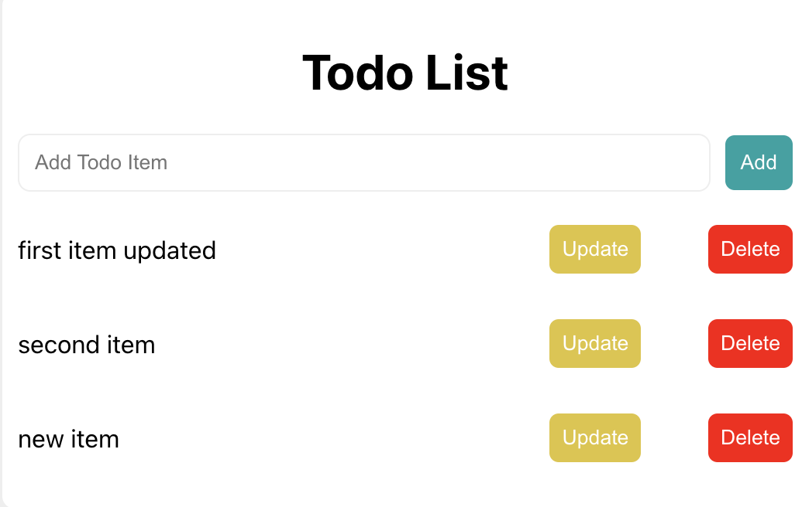

# ToDo app

# Project description

This is a school project for a course on data interaction. In this course, I built a simple ToDo app using the MERN stack.
MERN is a full-stack web development framework composed of four technologies: MongoDB, Express, React, and Node.
`MongoDB` is a document-oriented, NoSQL database used to store your app data.
`Express` is a framework layered on top of Node used to build the backend of a site using Node functions and structures. Since Node was not developed to make websites but rather to run JavaScript on a machine, Express was developed.
`React` is a library created by Facebook that is used to build UI components which create the user interface of a single page web application.
`Node` is a JavaScript runtime environment that provides you with the ability to run JavaScript on a machine rather than in a browser.
In my project, you can see how to pass data, create states, and connect the front-end to the back-end by fetching the data from the back-end.